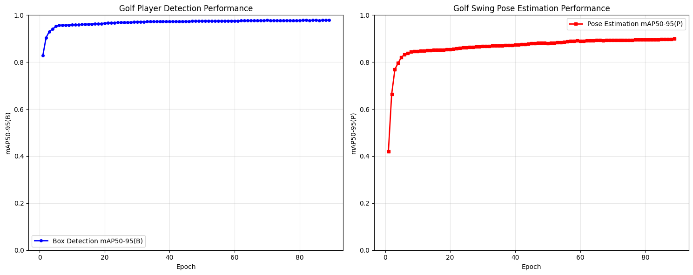
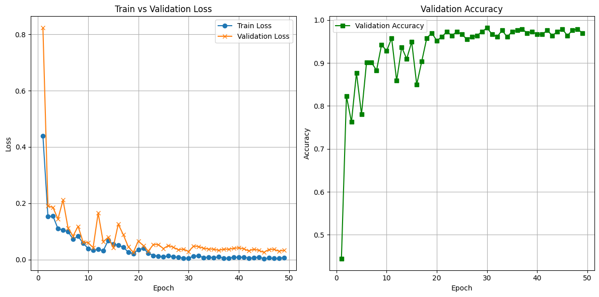
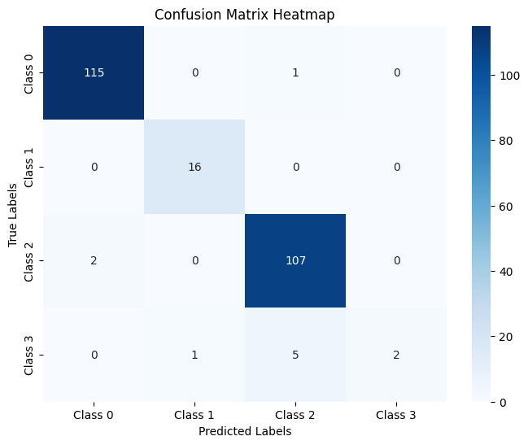
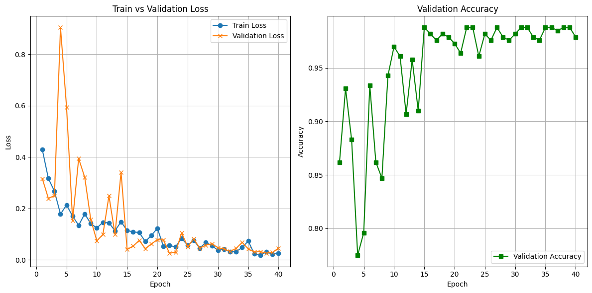
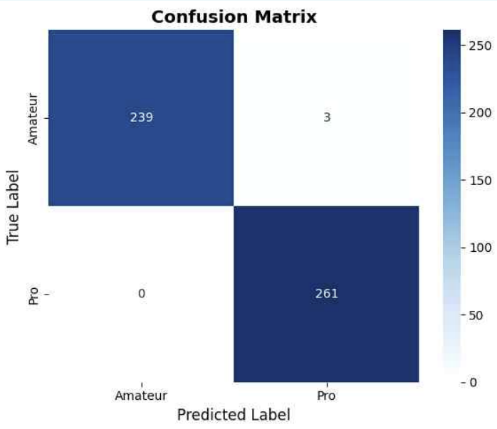

# 프로젝트명
- 🏌️‍♀️ 프라이빗 코인 골프장이 바로 이곳 (YOLO v8 Pose + ST-GCN Vision Ai 모델)

## 🗂 프로젝트 개요
- 문화체육관광부 조사결과 체육활동 중단이유 4위가 금전적 부담, 금전적 여유시 참여희망 종목 1위 골프임.
- 골프는 동작이 중요한 스포츠로, 레슨비(10분당 1만~2.25만원), 장비 및 장소 대여비 등 경제적 장벽이 높음.

## 📋 프로젝트 목적
- 레슨비 부담을 완화할 수 있는 무료 AI 코칭을 목표로 하여 **AI 기반 골프 동작 인식 모델**을 개발함.
- 사용자가 영상을 입력하면: 
  1. 80프레임으로 분할하여 이미지로 변환하고
  2. 'YOLO v8 Pose' 모델로 관절을 인식
  3. 인식된 관절 데이터를 'ST-GCN' 모델에 입력 자세를 분석하여 
  4. **amateur/semipro/pro** 중 하나의 레벨로 분류, 출력함.

## 📈 성과
- **YOLO v8 Pose 모델의 관절 탐지 성능**: mAP50-95(P) 0.898 (크롭 증강 적용 시)
  - 실제 환경 반영 데이터 증강 전략(크롭 3:7)으로 실제 서비스 환경 적용성 개선
- **YOLO v8 Pose 예측 결과를 활용해 원본 데이터에 자동으로 라벨을 생성하는 자체 프로그램** 개발.
  - 수작업 라벨링 대비 데이터 구축 효율과 품질 향상에 기여. (직접 라벨링 시 떨어졌던 둔부 위치 등의 정확도 상승)
  - 1장당 5분 이상 걸렸던 라벨링 시간 검수작업으로 2-3분으로 단축
  - 자동 라벨링 프로그램 코드: `/scripts/labeling_auto.py`
- **ST-GCN 모델**: 관절 시퀀스 기반 골프 동작 레벨 분류에서 2-class 분류 기준 테스트 정확도 97% 달성
  - 총 3,355개(3,334개 AI-Hub + 21개 직접 라벨링) 골프 동작 시퀀스 데이터셋 구축
- Colab Pro 환경에서 코드/데이터/설정 공개로 실험 재현성 확보
- Flask 기반 웹 UI로 실시간 추론 및 결과 시각화 기능 구현

> ※ YOLO로 관절 추출 후 ST-GCN으로 동작 예측하는 전체 파이프라인의 종단(e2e) 정확도는 별도로 수치화하지 않았으며, 데모로 확인 가능 (하단 시연 파트에서 링크 제공)

## 🛠️ 주요 기능 및 기술적 특징
- **YOLO v8 Pose**  
  - 골프 스윙 객체와 배경/캐디/관객을 구분하여 객체 추정  
  - 바운딩박스(객체 위치)와 16개 키포인트(관절 위치) 정밀 추출

- **자동 라벨링 프로그램**  
  - YOLO v8 Pose 예측 결과를 활용해 원본 데이터에 자동 라벨 생성
  - 자동 라벨링 프로그램 도입으로 라벨링 소요 시간 5분 → 2~3분으로 단축(최대 60% 효율 향상)
  - keypoint 좌표 자동 저장/변환 → ST-GCN 학습용 최적화 포맷 출력  
  - 코드 위치: `/scripts/labeling_auto.py`

- **ST-GCN(Spatial Temporal Graph Convolutional Network)**  
  - 프레임별 관절 데이터를 시공간 그래프로 변환  
  - 스윙 동작의 시계열 패턴 분석을 통한 등급 분류  
  - 테스트 정확도 97% 달성(2-class 분류)

- **최종 모델 파이프라인**
  - 영상 입력 시, 자동 라벨링 프로그램이 영상을 80프레임 시퀀스로 분할
  - 각 프레임에서 YOLO v8 Pose로 관절(keypoint) 추출
  - 추출된 시퀀스를 ST-GCN에 입력해 골프 스윙 레벨 자동 분류

- **Flask 기반 웹 UI**
  - 영상 업로드 및 실시간 추론, 결과 시각화, 사용자 피드백 기능 제공
  - 모델의 실제 활용성과 사용자 경험(UX)까지 고려한 엔드투엔드 시스템 구현
  
## 🔧 사용 기술
※ 본 프로젝트는 YOLO v8 Pose, 자동 라벨링 프로그램, ST-GCN 모델을 중심으로 구현되었으며, 각 기술의 역할은 위 기능 설명 참고.

## 🏷 팀 구성 및 역할
- 3인으로 구성 / 총 3주간 진행.
- 조예진 (팀원): 프로젝트 총괄, 전체 모델 설계 및 구현, 학습 데이터 수집, 구축 및 전처리, 사용자 화면구현 (Flask).
- 김희원 (팀장): 학습 데이터 구축 및 전처리, YOLO v8 Pose 모델 학습 및 검증.
- 이명진 (팀원): 학습 데이터 수집, 구축 및 전처리, 자동 라벨링 프로그램 구현, ST-GCN 학습.

## 🛠 데이터셋 및 환경
### YOLO V8 Pose
- 데이터셋
  - 데이터 출처: AI-Hub [스포츠 사람 동작 (골프)](https://aihub.or.kr/aihubdata/data/view.do?dataSetSn=123456)
- 해당 데이터는 AIHub 회원가입 후 다운로드할 수 있으며, 공개 라이선스 하에 제공받음
  - 데이터 구성: train (98,093), val (10,765), test (24,158)
  - 어노테이션 포맷: AI-Hub 제공 저작도구 사용
  - 키포인트 개수: 16개
  - 변환 작업: JSON → YOLO 포맷인 txt 형식으로 변환
  - 클래스 수: 1개 (사람)
  - 출력 형식: 16개 관절 좌표(x, y, visibility) + 바운딩박스(center_x, center_y, width, height)
  - 데이터 증강: 원본 이미지와 인물 크롭 이미지를 3:7 비율로 혼합
- 환경  
  - 모델 학습 환경: **Google Colab Pro**
    - 운영체제: Ubuntu (Colab 기본 환경)  
    - Python 버전: 3.10  
    - 주요 라이브러리: ultralytics, opencv, numpy 등  
    - 하드웨어: NVIDIA L4 GPU (VRAM 24GB)
    - 학습 설정: `epochs=100`, `early stopping (patience=10)` → 실제 학습은 88 epoch에서 조기 종료됨
  - 데이터 전처리/학습 검증/예측 환경 (로컬 PC)
    - 운영체제: Windows 11
    - Python 버전: 3.9.12
    - 주요 라이브러리: ultralytics, opencv, numpy 등
    - GPU: NVIDIA GeForce GTX 1660 SUPER
    - CUDA version: 12.1
    - cuDNN version: 90100
- 학습 설정
  - 데이터 전처리:
    - 원본 이미지: 480
    - 크롭 이미지: (960, 560) 크기로 통일하여 정제 후 학습에 활용
  - 배치 사이즈: 16
  - 에폭: 88
  - Optimizer: SGD

### ST-GCN
- 데이터셋
  - 입력 데이터: YOLO에서 추출한 16개 관절 시퀀스
  - 시퀀스 길이: 80프레임
  - 클래스 수: 
  - 1차 학습: 4 class (amateur, semi-pro, pro, legend)
  - 2차 학습: 2 class (amateur, semi-pro+pro+legend)
  - 입력: 16개 관절 시퀀스 (80프레임)
- 시퀀스 개수:
  - AI-Hub: 3,334개
  - 직접 라벨링: 21개
  - 총합: 3,355개
- 데이터 분할:
  - Train: 2,349개 (약 70%)
  - Validation: 503개 (약 15%)
  - Test: 503개 (약 15%)
  - 데이터 전처리: (예시: 정규화, 패딩 등)
- 환경
  - 운영체제: Windows 11
  - Python 버전: 3.9.12
  - 주요 라이브러리: torch, numpy
  - 하드웨어: 
    - GPU: NVIDIA GPU (모델명 미확인)
    - ※ 세부 환경 정보는 프로젝트 완료 후 확인 불가
- 학습 설정
  - 배치 사이즈: 32
  - 에폭: 88
  - Optimizer: Adam
  
- YOLO-pose로 추출한 keypoints를 ST-GCN 입력 포맷([N, C, T, V, M])으로 변환하여, 포즈 추정 결과를 기반으로 레벨을 출력하는 모델을 생성
- 자세한 변환 과정 및 코드는 별도 파일에 첨부 (yolo+stgcn.py 참고)

## 🧪 주요 실험/비교 결과
### 1. 모델 성능 비교
- **YOLO 모델**
  - **실험 결과 비교**
  - **1차 학습**
    - 학습 데이터: 원본
    - 테스트1 : 원본 → mAP50-95(B): 0.979 | mAP50-95(P): 0.951
    - 테스트2 : 크롭 → mAP50-95(B): 0.954 | mAP50-95(P): 0.831
    - 학습 시간: 88에폭, 약 23시간 (평균 16분/에폭)
  - **2차 학습**
    - 학습 데이터: 원본+크롭(3:7)
    - 테스트: 원본+크롭 → mAP50-95(B): 0.971 | mAP50-95(P): 0.88
    - 학습 시간: 88에폭, 약 23시간 (평균 16분/에폭)
  - **성능 개선**: 관절 탐지 정확도 3.3% 향상
  - **학습 환경**: 
    - 총 학습시간: 약 23시간 (88에폭, Colab Pro)
    - 1에폭당 평균: 약 16분 (로컬 GPU 대비 5.6배 개선)
      
- **ST-GCN 모델**
  - **데이터 분포**
	  - **1차 학습**
	    - **Train**: 클래스 0: 1,183개 (50%) | 클래스 1: 1,166개 (50%) | 총 2,349개
	    - **Valid**: 클래스 0: 240개 (48%) | 클래스 1: 263개 (52%) | 총 503개  
	    - **Test**: 클래스 0: 242개 (48%) | 클래스 1: 261개 (52%) | 총 503개
	  - **2차 학습**  
	    - **Train**: 클래스 0: 1,183개 (50%) | 클래스 1: 1,166개 (50%) | 총 2,349개
	    - **Valid**: 클래스 0: 240개 (48%) | 클래스 1: 263개 (52%) | 총 503개
	    - **Test**: 클래스 0: 242개 (48%) | 클래스 1: 261개 (52%) | 총 503개

- **학습 결과 비교**
  - **1차 학습 (4클래스)**
    - 정확도: 0.98
    - F1 점수: Amateur 0.9937, Pro 0.9943
    - 테스트 샘플: 503개
  - **1차 학습**
    - 정확도/손실 그래프  
    
    - Confusion Matrix  
    
  - **2차 학습 (2클래스)**
    - 정확도: 0.97
    - Macro F1: 0.88 | Weighted F1: 0.97
    - F1 점수: Class 0: 0.99, Class 1: 1.00
    - 테스트 샘플: 503개
  - **2차 학습**
      - 정확도/손실 그래프  
      
      - Confusion Matrix  
      
  - **2차 학습 상세 결과**  
    - **클래스 상세 성능**
      - **Class 0**: Precision 0.97 | Recall 1.00 | F1-score **0.99** | Support 242
      - **Class 1**: Precision 1.00 | Recall 1.00 | F1-score **1.00** | Support 261

### 2. 하드웨어별 성능 차이
- ST-GCN은 동일 GPU 환경에서만 실험하였으며, YOLO는 GTX 1660 Super와 Colab Pro에서 실험 결과를 비교함.
- Colab 환경에서는 압축 해제 오류와 느린 속도 문제 등이 발생해, RunPod, Colab Pro 등 다양한 환경을 실험하며 안정적인 학습 방식을 구축함.

### 3. 주요 발견사항
- **높은 정확도**: 두 실험 모두 97-98%의 우수한 성능 달성
- **균형적 데이터 분포**: 클래스 간 50:50 비율로 균형적 구성
- **안정적 성능**: 1차, 2차 실험 모두 일관된 고성능 유지
- **실험의 한계**: 데이터셋의 불균형으로 인해 일부 클래스의 학습 데이터가 부족하였으며, 추후 이 부분을 보완하여 추가 학습을 진행한다면 더 높은 성능의 모델 개발이 가능할 것으로 판단

### 🧩 본인 담당 파트
#### 조예진
##### 1. 모델 선정
##### 2. 데이터 전처리
##### 3. Flask 구현

#### 김희원
##### 1. 학습 데이터 구축 및 전처리
- ST-GCN 학습용 데이터 라벨링
  - 스윙영상을 80프레임으로 분할 후 16개 관절+바운딩박스 라벨링
- YOLO 학습용 데이터 전처리
  - 원본 이미지 데이터 중 일부의 배경을 잘라 bb박스 0.7을 기준으로 인물이 크게 나오도록 이미지 크롭 수행
- 최종 학습 데이터셋 구성 (2차 기준):
  - train: 98,093 / val: 10,765 / test: 24,158 (원본:크롭 = 3:7)

##### 2. YOLO v8 Pose 모델 최적화
- **1차 학습**
  - 데이터: train 80,000 / val 10,000 / test 10,000 (원본 이미지)
  - 테스트: 
    - 원본 test: mAP50-95(P) 0.951
    - 크롭 test: mAP50-95(P) 0.831
  - 해석: 원본과 유사한 구도에서는 높은 성능, 인물이 크게 나온(배경이 잘린) 이미지에서는 성능 저하 확인
- **2차 학습**
  - 데이터: train 98,093 / val 10,765 / test 24,158 (원본:크롭=3:7)
  - 테스트: 원본+크롭 혼합 test, mAP50-95(P) 0.88
  - 해석: 상용화 환경(인물이 크게 나오는 상황) 고려해 데이터 가공 및 학습, 관절 탐지 1차 학습 대비 정확도 3.3% 향상

#### 이명진
##### 1. 데이터 다운 및 선별
- AIHub, YouTube 등 다양한 소스에서 골프 스윙 영상을 수집 
- 불필요하거나 품질이 낮은 영상을 제거하고, 스윙 시작부터 끝까지 동작이 명확한 영상만 선별

##### 2. 학습 데이터 구축 및 전처리
- 영상을 일정 프레임 수(예: 80프레임)로 균일하게 샘플링
- 손목 좌표의 움직임을 분석하여 **셋업 - 스윙 - 피니시** 구간 자 구분 
- 전처리된 이미지와 함께 키포인트 라벨(.json) 및 시각화 이미지 저장

##### 3. 자동라벨링 프로그램 구현
- `YOLOv8-pose` 모델을 활용하여 골프 스윙 프레임에서 사람의 포즈(키포인트) 자동 추론
- 추론 결과는 다음과 같은 폴더 구조로 저장됨:
	legend_swing01/
├── image/ # 원본 프레임
├── json/ # 키포인트 라벨 (.json)
├── visual/ # 시각화된 프레임 이미지
└── legend_swing01.png # 전체 시각화 미리보기

### 🎥 시연 영상
- 본 프로젝트의 주요 기능 및 동작 과정을 시연한 데모
👉 [YouTube로 보기]([https://www.youtube.com/watch?v=영상ID](https://youtu.be/c6_HHAyw0Bs)
- Flask 웹 UI 예시는 발표 자료(PPT)에 캡처 포함. 실시간 추론과 결과 시각화 기능을 시연 영상에서 확인 가능.

### 📄 발표 자료
- [노션 발표자료 바로가기](https://www.notion.so/MAIN-1e6de7d9381d8072b69def7f458f073e)
- 발표용 PPT 파일: [golf_project.pptx](./presentation/golf_project.pptx)

### 💡 느낀 점/회고
#### 📝 프로젝트 주요 사실 (Facts)
- YOLOv8 Pose 모델과 ST-GCN을 활용하여 골프 스윙 분석 시스템을 구현
- 데이터셋 수집, 가공 및 전처리에 많은 시간과 노력이 소요되었음
- 반복 실험을 통해 성능을 지속적으로 개선하려고 노력함

#### 🔍 주요 교훈 (Findings)
- 데이터 품질이 모델 성능에 결정적 영향을 준다는 점을 실감
- 실험 기록, 버전 관리, 모델 설정의 정밀함이 성과에 큰 영향을 미침

#### 🚀 향후 방향 (Future Action)
- 데이터 파이프라인 자동화 및 실험 로깅 체계화 추진 예정
- 다양한 GCN 계열 모델 및 파라미터 조합 실험을 통한 추가 성능 개선 계획
- 실제 서비스 제공을 위한 모델 성능 향상 및 플랫폼 고도화 예정

#### 🤝 협업 경험 (Feedback)
- 협업과 버전 관리의 중요성을 직접 체감함
- 반복 실험과 문제 해결 과정을 통해 실무 능력 및 소통 능력을 강화하고, 팀워크의 중요성을 깊이 인식함
